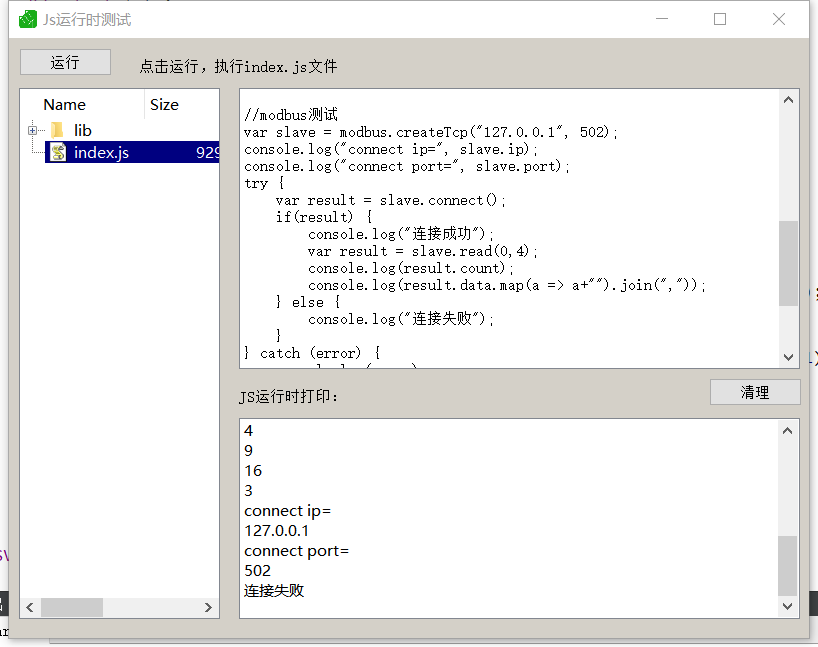

# 监控系统
注意：本系统是我参考游戏行业(Cocos2dx)以及多年从事工业监控总结，由于时间关系和精力所限，进度会很慢。

## 架构图


## 编译说明
- 基于cmake构建，各个部分独立编译
- src-qt-ui是qt工程
- test-3rd下可以生成各种库的测试代码

## 脚本引擎
基于quickjs



``` js
//modbus测试
var slave = modbus.createTcp("127.0.0.1", 502);
console.log("connect ip=", slave.ip);
console.log("connect port=", slave.port);
try {    
    var result = slave.connect();
    if(result) {
        console.log("连接成功");
        var result = slave.read(0,4);
        console.log(result.count);
        console.log(result.data.map(a => a+"").join(","));
    } else {
        console.log("连接失败");
    }
} catch (error) {
    console.log(error); 
}
```

## 协议栈

### modbus-slave
以libmodbus为基础

### modbus-master
以freemodbus为基础

### IEC104
暂缺

### SNMP
暂缺