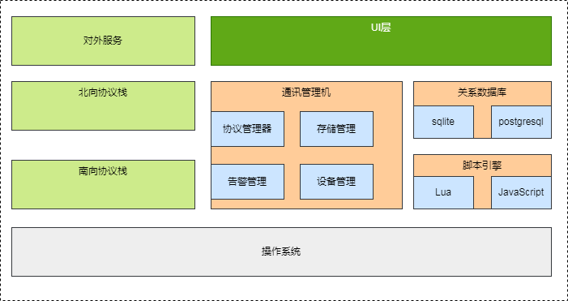
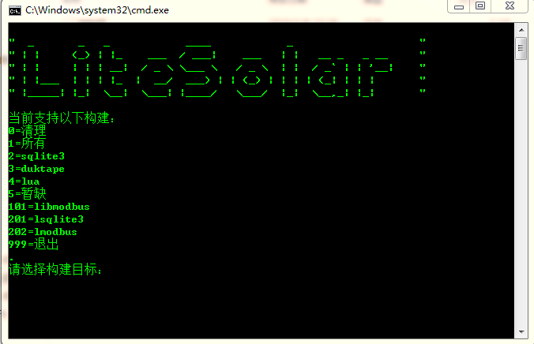

# 监控系统
注意：本系统是我参考游戏行业(Cocos2dx)以及多年从事工业监控总结，由于时间关系和精力所限，进度会很慢。

## 架构图

## 编译说明
- 暂时只支持mingw编译器，编译前必须设置好环境变量
- 可以使用make目录生成各种动态库
- test-3rd下可以生成各种库的测试代码
**注意：下图是构建截图**

## 脚本引擎

### lua引擎
基于lua5.3版本构建，可以在test-3rd中找到测试和基本使用方法

### javascript引擎
基于duktape构建，可以在test-3rd中找到测试和基本使用方法  
测试代码已经完成基本js绑定测试（js文件支持require调用）  

## 协议栈

### modbus-slave
以libmodbus为基础

### modbus-master
以freemodbus为基础

### IEC104
暂缺

### SNMP
暂缺